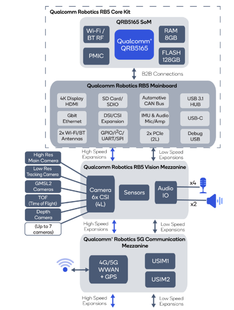

+++
title = 'Introduction'
date = 2024-09-25T13:07:04-07:00
draft = false
weight = 1
+++

The Qualcomm Robotics RB5 Development Kit is a powerful platform for creating robotic devices. By the end of these guides, you will have set up the device from scratch and built a ROS2 application for it. While not strictly necessary, some knowledge of the command line will make the process much easier.

## System Block Diagram

## Useful Links


  
  
  

